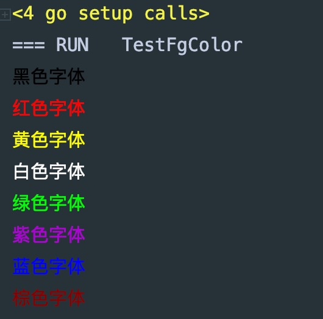

# termcolor
> termcolor 可以将命令行输出带上自定义颜色


# quick start

1.install
```bash
go get github.com/pibigstar/termcolor
```

2.test

背景色
```go
func TestBgColor(t *testing.T) {
	fmt.Println(BgBlack("黑色背景"))
	fmt.Println(BgRed("红色背景"))
	fmt.Println(BgYellow("黄色背景"))
	fmt.Println(BgWhite("白色背景"))
	fmt.Println(BgGreen("绿色背景"))
	fmt.Println(BgPurple("紫色背景"))
	fmt.Println(BgBlue("蓝色背景"))

	// 自定义
	fmt.Println(BgRGB("棕色背景", 128, 42, 42))
}
```


字体颜色
```go
func TestFgColor(t *testing.T) {
	fmt.Println(FgBlack("黑色字体"))
	fmt.Println(FgRed("红色字体"))
	fmt.Println(FgYellow("黄色字体"))
	fmt.Println(FgWhite("白色字体"))
	fmt.Println(FgGreen("绿色字体"))
	fmt.Println(FgPurple("紫色字体"))
	fmt.Println(FgBlue("蓝色字体"))

	// 自定义
	fmt.Println(FgRGB("棕色字体", 128, 42, 42))
}
```
